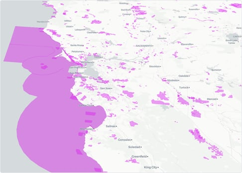
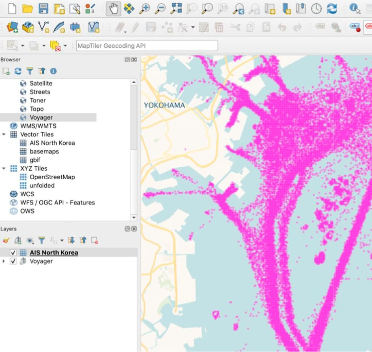
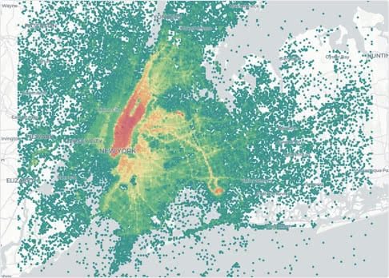

## UPDATE ##

CARTO is currently working on an entire restructure of this project to include documentation, tests and CI. On the process we will restructure components and do very significant changes. Our goal is to be ready by end of February. These functions will continue working now and after the changes to avoid breaking ETLs or disturb users using them. You can still send PR if you want to, but we recommend waiting for this refactor before doing investing any significant amlunt of work. Thanks!

# BigQuery JS Libs: A repository of pre-packaged libraries to be used as functions inside BigQuery

BigQuery allows you to create UDF functions using JS. In order to do so you have to upload the JS library into a Google Cloud Storage bucket and then create wrapper UDF functions to call them. We find the need of using external libraries very often so we have created this repo of prepared libraries to be used within BigQuery.

Because the way BigQuery works it is possible to use UDFs that are stored on a different project/dataset than the account you are calling from. So instead of asking you to push these functions to your own BigQuery project we have made them already available inside a project called `jslibs` in the us-region.

That way using a library like Uber H3, it is as simple as:

``` sql
SELECT jslibs.h3.ST_H3(ST_GEOGPOINT(-74.0060,40.7128),11)
```

No need to install anything, just start using them, and if you want to see what functions are available you can always pin the project and you will see all libraries that had been **bigquerified**

## Function locations

BigQuery allows you to run functions or more specifically datasets from within the same [regional location](https://cloud.google.com/bigquery/docs/locations). So if you are running a query for a dataset in the EU region you are going to have to use the eu functions. We have created for each function the following signatures:

```
jslibs.h3.ST_H3
jslibs.us_h3.ST_H3
jslibs.eu_h3.ST_H3
```
They are identical. The one not qualified, the first one is on US and is just there for convinience. If you need to access these functions from within a different location than US or EU, you should install yourself the functions on your location. 

## Function names ##

The fucntions try to match as possible the syntax of the original JS library, like for example `h3.h3Index`, but also additional wrapper functions like `ST_H3` are also created that feel more natural compared to the built-in functions in BigQuery.

You can get the documentation of a particular library inside its folder.

## libaries versions ##

We try to maintain the libaries on different versions and a latest folder. You can choose to use a funtion in a particular version or the latest. For example:

``` sql
SELECT jslibs.h3.ST_H3(pointGeog,7)
```

## How about visualizing very large datasets or creating vector tiles ##

We have been working on a solution to create TileSets directly from BigQuery called [CARTO BigQuery Tiler](https://carto.com/bigquery/beta/). It makes use of many functions on this repo and several more. Here are a few screenshots of these type of visualizations:







## Screenshots and examples

First library included is H3 so here are a few screenshots of their use.

``` sql
WITH data as (
	SELECT jslibs.h3.compact(
  	jslibs.h3.ST_H3_POLYFILLFROMGEOG(tract_geom,11)) as geo 
  	FROM `bigquery-public-data.geo_census_tracts`.census_tracts_new_york 
  	WHERE geo_id='36081000100')

SELECT jslibs.h3.ST_H3_BOUNDARY(h3) as h3geo 
FROM data,UNNEST(geo) as h3
```


