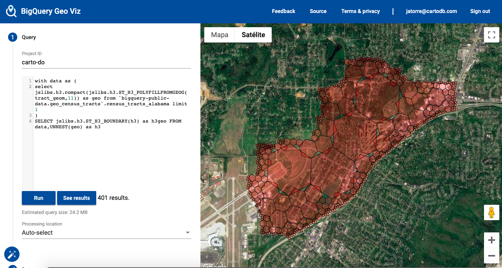
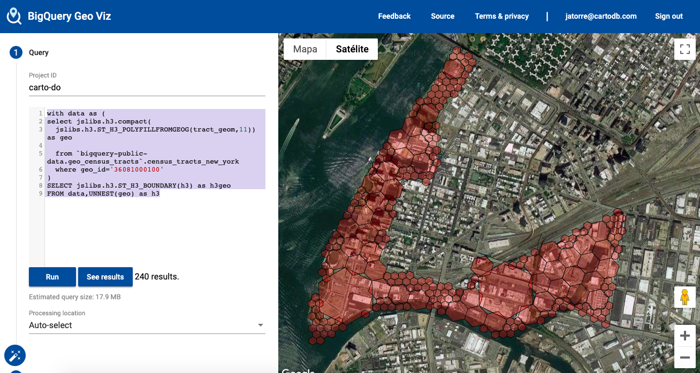
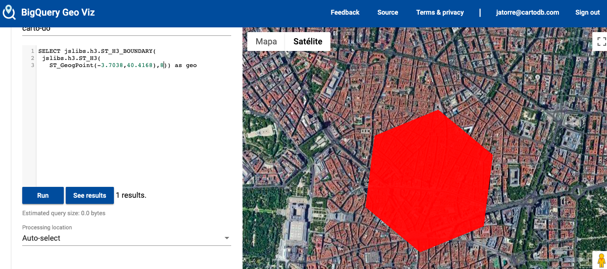

# BigQuery JS Libs: A repository of pre-packaged libraries to be used as functions inside BigQuery

BigQuery allows you to create UDF functions using JS. In order to do so you have to upload the JS library into a Google Cloud Storage bucket and then create wrapper UDF functions to call them. We find the need of using external libraries very often so we have created this repo of prepared libraries to be used within BigQuery.

Because the way BigQuery works it is possible to use UDFs that are stored on a different project/dataset than the account you are calling from. So instead of asking you to push these functions to your own BigQuery project we have made them already available inside a project called `jslibs` in the us-region.

That way using a library like Uber H3, it is as simple as:

`SELECT jslibs.h3.ST_H3(pointGeog,7) FROM myproject.mydataset.mytable`

No need to install anything, just start using them, and if you want to see what functions are available you can always pin the project and you will see all libraries that had been **bigquerified**


## Function names ##

The fucntions try to match as possible the syntax of the original JS library, like for example `h3.h3Index`, but also additional wrapper functions like `ST_H3` are also created that feel more natural compared to the built-in functions in BigQuery.

You can get the documentation of a particular library inside its folder.

## libaries versions ##

We try to maintain the libaries on different versions and a latest folder. You can choose to use a funtion in a particular version or the latest. For example:

`SELECT jslibs.h3.ST_H3(pointGeog,7)`

or

`SELECT jslibs.h3_3_5_0.ST_H3(pointGeog,7)`

## Screenshots and examples

First library included is H3 so here are a few screenshots of their use.

```
WITH data as (
	SELECT jslibs.h3.compact(
  	jslibs.h3.ST_H3_POLYFILLFROMGEOG(tract_geom,11)) as geo 
  	FROM `bigquery-public-data.geo_census_tracts`.census_tracts_new_york 
  	WHERE geo_id='36081000100')

SELECT jslibs.h3.ST_H3_BOUNDARY(h3) as h3geo 
FROM data,UNNEST(geo) as h3
```








