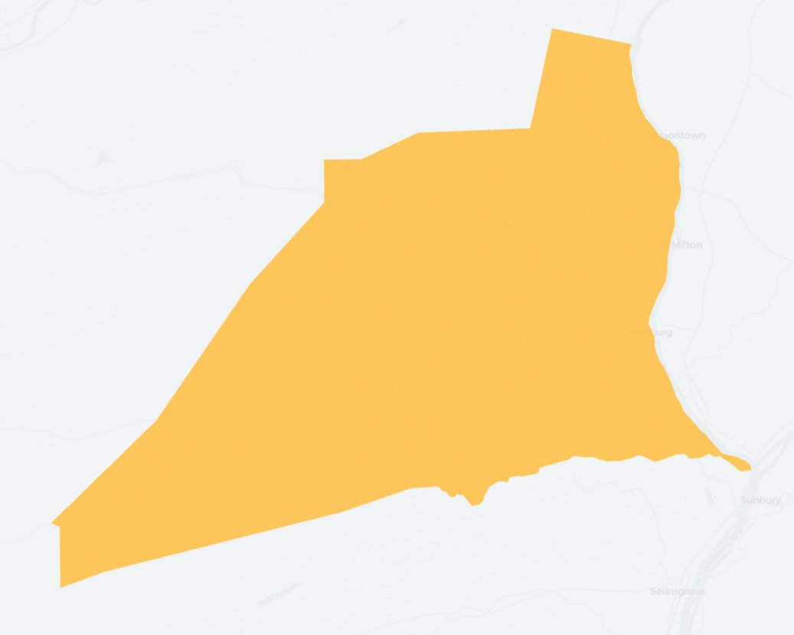
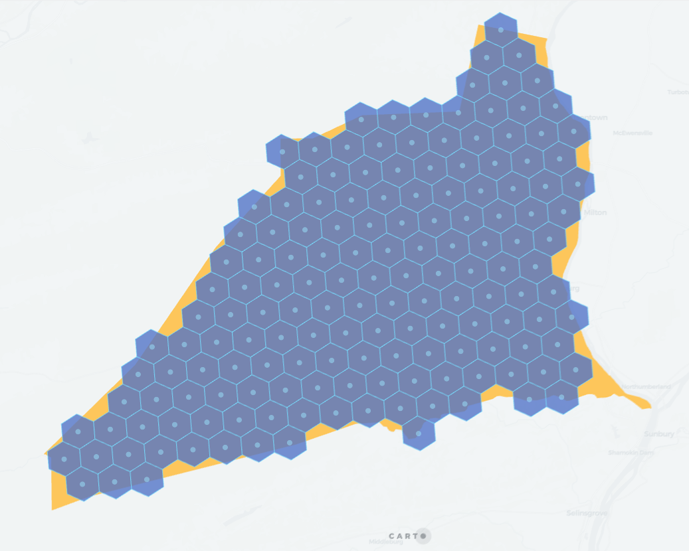
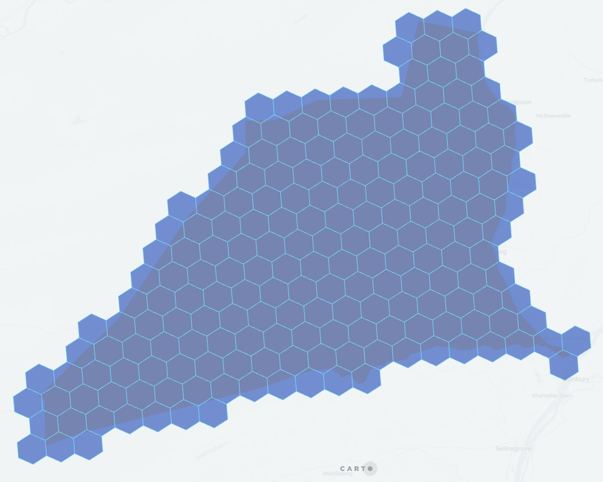
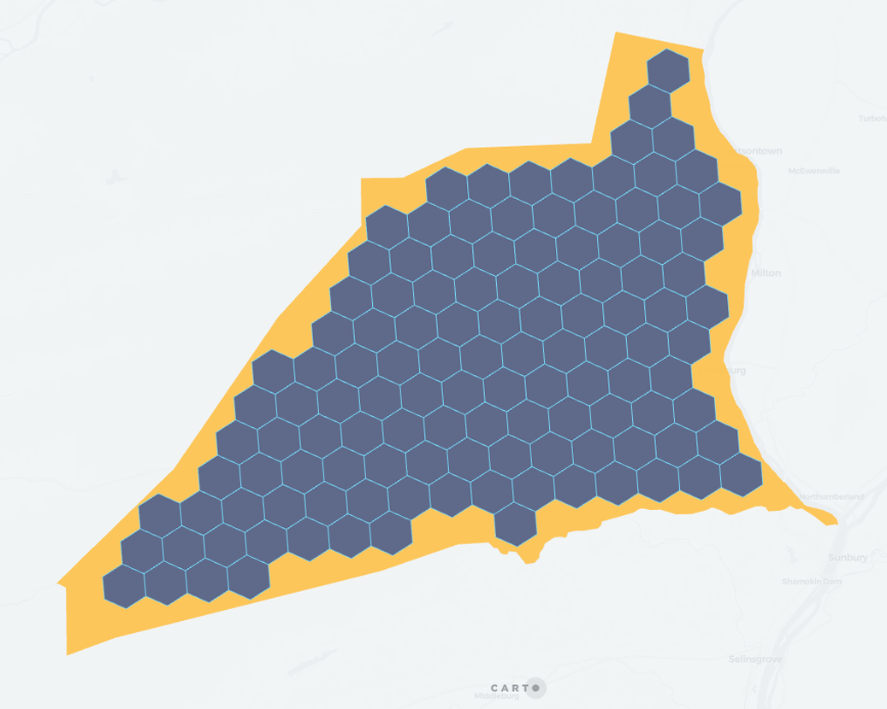

## H3_POLYFILL_MODE

```sql:signature
H3_POLYFILL_MODE(geography, resolution, mode)
```

**Description**

This function is similar to [`H3_POLYFILL`](h3#h3_polyfill), but allows more control over how polygons are respresented by H3 cells.

It can operate on three modes:

* `center` returns the indices of the H3 cells that have its center within the input polygon. This doesn't guarantee that the polygon is fully covered by the H3 cells, nor that all the cells are completely within the polygon. This mode is the most performant (results will be obtained faster).
* `intersects` is equivalent to [`H3_POLYFILL`](h3#h3_polyfill) and returns the indices of the H3 cells that intersect the input polygon. The resulting H3 will completely cover the input polygon. This could be used with line or point geometries, but we recommend using [`H3_POLYFILL`](h3#h3_polyfill) with those. This is the least performant mode.
* `contains` return the indices of the H3 cells that are completely inside the input polygon.

It will return `null` on error (invalid geography type or resolution out of bounds). In case of lines, it will return the H3 cell indexes intersecting those lines. For a given point, it will return the H3 index of cell in which that point is contained equivalent to [`H3_FROMGEOPOINT`](h3#h3_fromgeopoint) results

* `geography`: `GEOGRAPHY` representing the area to cover.
* `resolution`: `INT64` number between 0 and 15 with the [H3 resolution](https://h3geo.org/docs/core-library/restable).
* `mode`: `STRING` one of `center`, `intersects` or `contains`.

**Return type**

`ARRAY<STRING>`

**Example**


```sql
SELECT carto.H3_POLYFILL_MODE(
    ST_GEOGFROM('POLYGON((-77.158 41.031, -77.358 40.807, -76.838 40.902, -76.913 41.142, -77.158 41.031))'),
    7,
    'center'
);
-- 872aa1400ffffff
-- 872aa1401ffffff
-- 872aa1402ffffff
-- 872aa1403ffffff
-- 872aa1404ffffff
-- 872aa1405ffffff
-- ...
```

For example, given this polygon:



The resulting cells with mode `center` are:



Mode `intersects`:



Mode `contains`:


