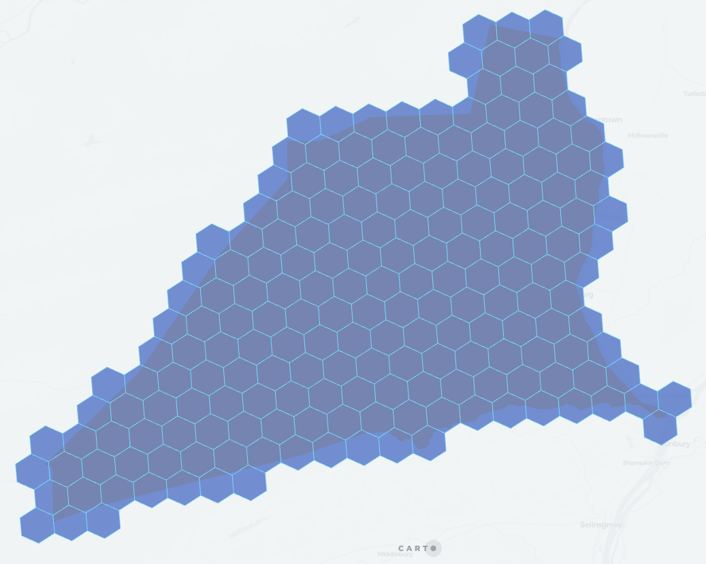

## H3_POLYFILL_MODE

```sql:signature
H3_POLYFILL_MODE(geog, resolution, mode)
```

**Description**

Returns an array of quadbin cell indexes contained in the given geography at a given level of detail. Containment is determined by the mode: center, intersects, contains.

* `geog`: `GEOGRAPHY` representing the shape to cover.
* `resolution`: `INT64` level of detail. The value must be between 0 and 15 ([H3 resolution table](https://h3geo.org/docs/core-library/restable)).
* `mode`: `STRING`
  * `center` returns the indexes of the H3 cells which centers intersect the input geography (polygon). The resulting H3 set does not fully cover the input geography, however, this is **significantly faster** that the other modes. This mode is not compatible with points or lines. Equivalent to [`H3_POLYFILL`](h3#h3_polyfill).
  * `intersects` returns the indexes of the H3 cells that intersect the input geography. The resulting H3 set will completely cover the input geography (point, line, polygon).
  * `contains` returns the indexes of the H3 cells that are entirely contained inside the input geography (polygon). This mode is not compatible with points or lines.

Mode `center`:


Mode `intersects`:



Mode `contains`:


**Return type**

`ARRAY<STRING>`

**Examples**

```sql
SELECT carto.H3_POLYFILL_MODE(
  ST_GEOGFROMTEXT('POLYGON ((-3.71219873428345 40.413365349070865, -3.7144088745117 40.40965661286395, -3.70659828186035 40.409525904775634, -3.71219873428345 40.413365349070865))'),
  9, 'intersects'
);
-- [89390cb1b5bffff, 89390ca34b3ffff, 89390ca3487ffff, 89390ca3497ffff, 89390cb1b4bffff, 89390cb1b4fffff]
```

```sql
SELECT h3
FROM UNNEST(carto.H3_POLYFILL_MODE(
  ST_GEOGFROMTEXT('POLYGON ((-3.71219873428345 40.413365349070865, -3.7144088745117 40.40965661286395, -3.70659828186035 40.409525904775634, -3.71219873428345 40.413365349070865))'),
  9, 'intersects'
)) AS h3;
-- 89390cb1b5bffff
-- 89390ca34b3ffff
-- 89390ca3487ffff
-- 89390ca3497ffff
-- 89390cb1b4bffff
-- 89390cb1b4fffff
```
