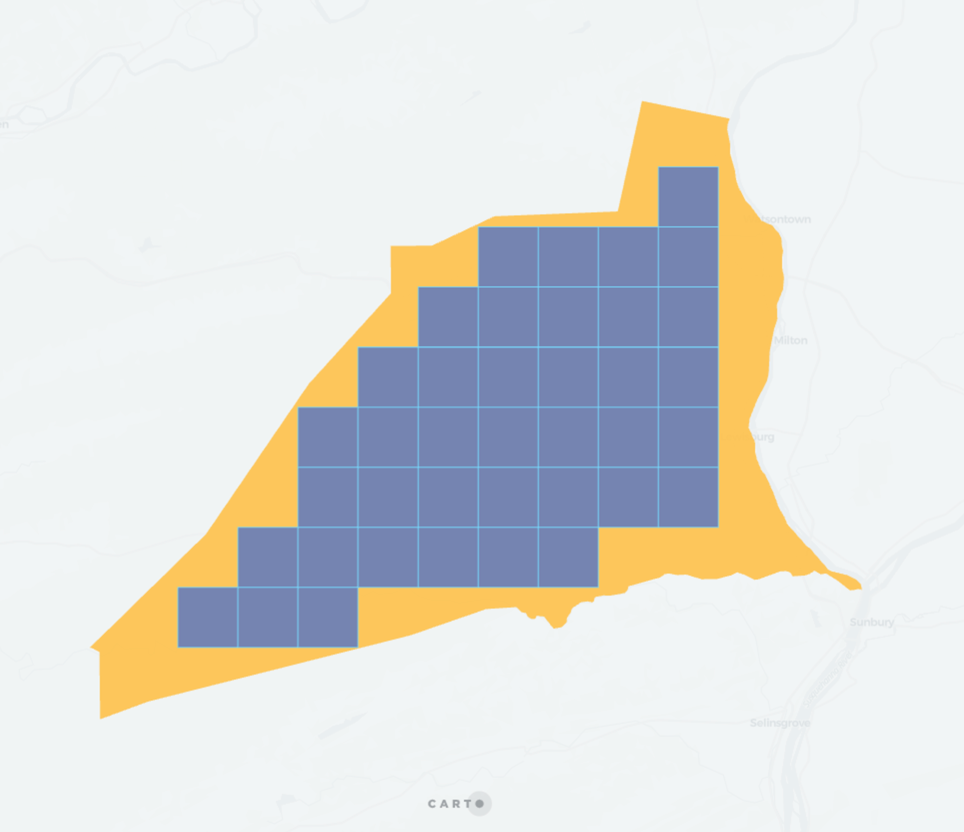

## QUADBIN_POLYFILL_MODE

```sql:signature
QUADBIN_POLYFILL_MODE(geog, resolution, mode)
```

**Description**

Returns an array of quadbin cell indexes that intersect with the given geography at a given level of detail. This function is similar to [`QUADBIN_POLYFILL`](quadbin#quadbin_polyfill), but allows more control on how quadbin cells are computed. It can operates on three modes: intersects, contains, center.

* `geog`: `GEOGRAPHY` representing the area to cover.
* `resolution`: `INT64` level of detail. The value must be between 0 and 26.
* `mode`: `STRING`
  * `intersects` (default) returns the indexes of the quadbin cells that intersect the input geography. The resulting quadbin set will completely cover the input geography (point, line, polygon). This mode is the one used in [`QUADBIN_POLYFILL`](quadbin#quadbin_polyfill).
  * `contains` returns the indexes of the quadbin cells that are entirely contained inside the input geography (polygon). This mode is not compatible with points or lines.
  * `center` returns the indexes of the quadbin cells which centers intersect the input geography (polygon). The resulting quadbin set does not fully cover the input geography, however this is significantly faster that the other modes. This mode is not compatible with points or lines.

Mode `intersects`:


Mode `contains`:



Mode `center`:


**Return type**

`ARRAY<INT64>`

**Examples**

```sql
SELECT carto.QUADBIN_POLYFILL_MODE(
  ST_GEOGFROMTEXT('POLYGON ((-3.71219873428345 40.413365349070865, -3.7144088745117 40.40965661286395, -3.70659828186035 40.409525904775634, -3.71219873428345 40.413365349070865))'),
  17, 'center'
);
-- [5265786693163941887, 5265786693164466175 ,5265786693164728319]
```

```sql
SELECT quadbin
FROM UNNEST(carto.QUADBIN_POLYFILL_MODE(
  ST_GEOGFROMTEXT('POLYGON ((-3.71219873428345 40.413365349070865, -3.7144088745117 40.40965661286395, -3.70659828186035 40.409525904775634, -3.71219873428345 40.413365349070865))'),
  17, 'center'
)) AS quadbin;
-- 5265786693163941887
-- 5265786693164466175
-- 5265786693164728319
```
