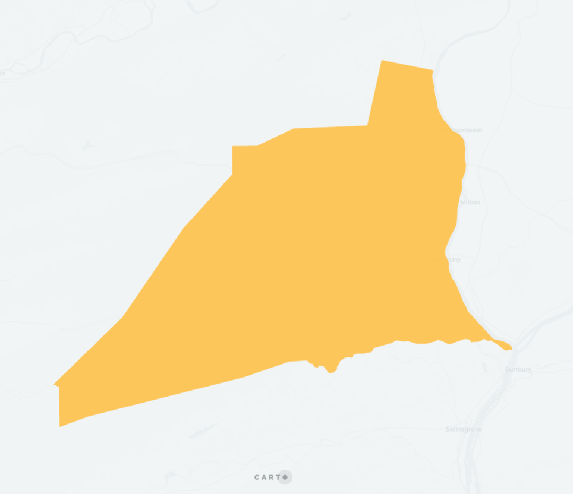

## QUADBIN_POLYFILL_MODE

```sql:signature
QUADBIN_POLYFILL_MODE(geography, resolution, mode)
```

**Description**

This function is similar to [`QUADBIN_POLYFILL`](quadbin#quadbin_polyfill), but allows more control over how polygons are respresented by quadbin cells.

* `geography`: `GEOGRAPHY` representing the area to cover.
* `resolution`: `INT64` number between 0 and 15 with the [Quadbin resolution](https://docs.carto.com/data-and-analysis/analytics-toolbox-for-bigquery/key-concepts/spatial-indexes#quadbin).
* `mode`: `STRING` one of
    * `intersects`
    * `center`
    * `contains`.

It can operate on three modes:

* `intersects` is equivalent to [`QUADBIN_POLYFILL`](quadbin#quadbin_polyfill) and returns the indices of the quadbin cells that intersect the input polygon. The resulting quadbin will completely cover the input polygon. This could be used with line or point geometries, but we recommend using [`QUADBIN_POLYFILL`](quadbin#quadbin_polyfill) with those. This is the least performant mode.
* `center` returns the indices of the quadbin cells that have its center within the input polygon. This doesn't guarantee that the polygon is fully covered by the quadbin cells, nor that all the cells are completely within the polygon. This mode is the most performant (results will be obtained faster).
* `contains` return the indices of the quadbin cells that are completely inside the input polygon.

It will return `null` on error (invalid geography type or resolution out of bounds). In case of lines, it will return the quadbin cell indexes intersecting those lines. For a given point, it will return the quadbin index of cell in which that point is contained equivalent to [`QUADBIN_FROMGEOPOINT`](quadbin#quadbin_fromgeopoint) results

**Return type**

`ARRAY<INT64>`

**Example**

Unnesting array result allow quadbin visualization in Carto platfom.

```sql
SELECT
    quadbins
FROM
    UNNEST(
        carto.QUADBIN_POLYFILL_MODE(
            ST_GEOGFROM('POLYGON((-77.158 41.031, -77.358 40.807, -76.838 40.902, -76.913 41.142, -77.158 41.031))'),
            9,
            'intersects')
        ) as quadbins;

-- 5229574977296007167
-- 5229668762201882623
-- 5229668813741490175
```

For example, given this polygon:



The resulting cells with mode `center` are:


Mode `intersects`:


Mode `contains`:


