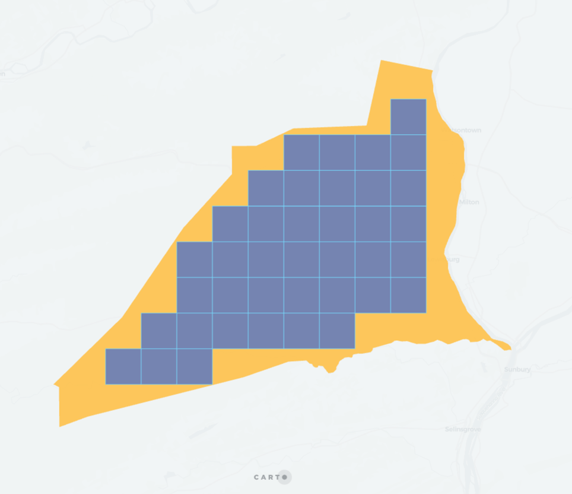

## QUADBIN_POLYFILL

```sql:signature
QUADBIN_POLYFILL(geometry, resolution [, mode])
```
**Description**

Returns an array with all the QUADBIN cell indexes which intersect a given polygon, line or point. It will return `null` on error (invalid geometry type or resolution out of bounds).

This function is equivalent to using [`QUADBIN_POLYFILL](quadbin#quadbin_polyfill) with parameter `mode` = `intersects`. If the input geometry is a polygon check that function for more options and better performance.

It can operates on three modes:

* `intersects` returns the indices of the QUADBIN cells that intersect the input polygon. The resulting QUADBIN will completely cover the input polygon. This is the least performant mode.
* `center` returns the indices of the QUADBIN cells that have its center within the input polygon. This doesn't guarantee that the polygon is fully covered by the QUADBIN cells, nor that all the cells are completely within the polygon. This mode is the most performant (results will be obtained faster).
* `contains` return the indices of the QUADBIN cells that are completely inside the input polygon.

It will return `null` on error (invalid geography type or resolution out of bounds). In case of lines, it will return the QUADBIN cell indexes intersecting those lines. For a given point, it will return the QUADBIN index of cell in which that point is contained equivalent to [`QUADBIN_FROMGEOPOINT`](quadbin#quadbin_fromgeopoint) results

* `geometry`: `GEOMETRY` **polygon** or **multipolygon** representing the area to cover.
* `resolution`: `INT` number between 0 and 15 with the [Quadbin resolution](https://docs.carto.com/data-and-analysis/analytics-toolbox-for-bigquery/key-concepts/spatial-indexes#quadbin).
* `mode` (optional): `VARCHAR` one of
    * `intersects` (default)
    * `center`
    * `contains`.

**Return type**

`BIGINT[]`

**Example**

```sql
SELECT carto.QUADBIN_POLYFILL(
  ST_GEOMFROMTEXT('POLYGON ((-3.71219873428345 40.413365349070865, -3.7144088745117 40.40965661286395, -3.70659828186035 40.409525904775634, -3.71219873428345 40.413365349070865))'),
  17);
-- [5265786693153193983, 5265786693163941887, 5265786693164466175, 5265786693164204031 5265786693164728319, 5265786693165514751]
```

Unnesting array result allow QUADBIN visualization in Carto platfom.

```sql
SELECT UNNEST(carto.QUADBIN_POLYFILL(
  ST_GEOMFROMTEXT('POLYGON ((-3.71219873428345 40.413365349070865, -3.7144088745117 40.40965661286395, -3.70659828186035 40.409525904775634, -3.71219873428345 40.413365349070865))'),
  17)
);
-- 5265786693153193983
-- 5265786693163941887
-- 5265786693164466175
-- 5265786693164204031
-- 5265786693164728319
-- 5265786693165514751
```

For example, given this polygon:


The resulting cells with mode `center` are:


Mode `intersects`:


Mode `contains`:


