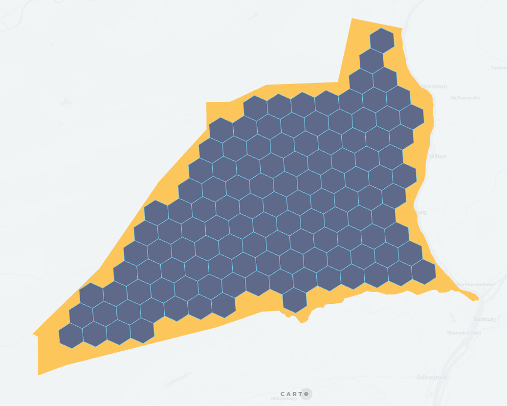

## H3_POLYFILL

```sql:signature
H3_POLYFILL(geography, resolution [, mode])
```

**Description**

Returns an array with all the H3 cell indexes which intersect a given polygon, line or point. It will return `null` on error (invalid geometry type or resolution out of bounds).

This function is equivalent to using [`H3_POLYFILL](h3#h3_polyfill) with parameter `mode` = `intersects`. If the input geometry is a polygon check that function for more options and better performance.

The command can operate on three modes:

* `intersects` returns the indices of the H3 cells that intersect the input polygon. The resulting H3 will completely cover the input polygon. This is the least performant mode.
* `center` returns the indices of the H3 cells that have its center within the input polygon. This doesn't guarantee that the polygon is fully covered by the H3 cells, nor that all the cells are completely within the polygon. This mode is the most performant (results will be obtained faster).
* `contains` return the indices of the H3 cells that are completely inside the input polygon.

It will return `null` on error (invalid geography type or resolution out of bounds). In case of lines, it will return the H3 cell indexes intersecting those lines. For a given point, it will return the H3 index of cell in which that point is contained equivalent to [`H3_FROMGEOPOINT`](h3#h3_fromgeopoint) results

* `geography`: `GEOGRAPHY` **polygon** or **multipolygon** representing the area to cover.
* `resolution`: `INT` number between 0 and 15 with the [H3 resolution](https://h3geo.org/docs/core-library/restable).
* `mode` (optional): `STRING` one of
    * `intersects` (default)
    * `center`
    * `contains`

**Return type**

`ARRAY<STRING>`

**Example**

```sql
SELECT carto.H3_POLYFILL(
    TO_GEOGRAPHY('POLYGON ((30 10, 40 40, 20 40, 10 20, 30 10))'), 4);
-- [842da29ffffffff, 843f725ffffffff, 843eac1ffffffff, 8453945ffffffff, ...]
```

Flattening array result allow H3 visualization in Carto platfom.

```sql
SELECT h3.value
FROM LATERAL FLATTEN(CARTO.H3_POLYFILL(
    TO_GEOGRAPHY('POLYGON ((30 10, 40 40, 20 40, 10 20, 30 10))'), 4)
) AS h3;
-- 842da29ffffffff
-- 843f725ffffffff
-- 843eac1ffffffff
-- 8453945ffffffff
-- ...
```

For example, given this polygon:


The resulting cells with mode `center` are:


Mode `intersects`:


Mode `contains`:



