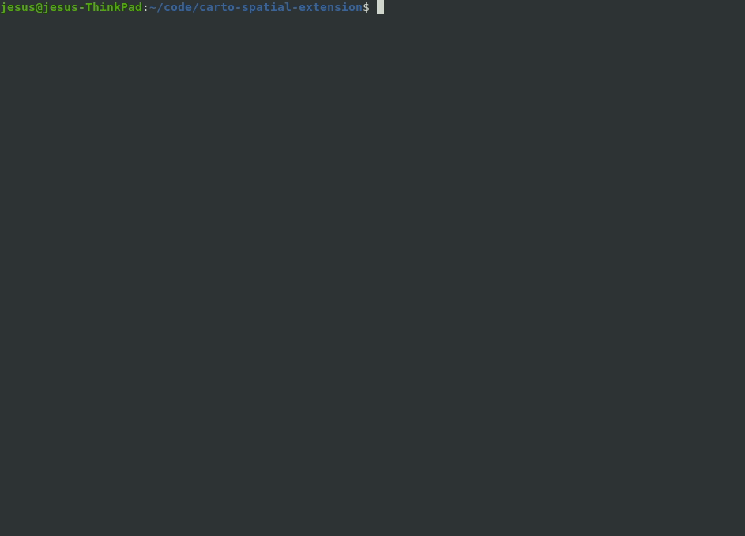

# SETool

A tool to help develop the Spatial Extension.

## Description

This is a CLI tool to help developers add new code to the extension.

We offer this tool as an alternative to "copy and paste a skel directory and do all the replacements manually", so contributing becomes much easier and faster.

## Installation

To install or update this tool globally, run:

```bash
cd tools/setool
npm install
npm install -g
```

## Usage

Available commands:

```bash
setool create module
```



```bash
setool create function
```